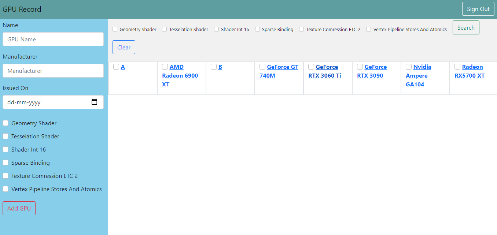

# GPU Database

I have created a basic web application that contain information about GPU’s (In my process of learning) using python, Google App engine and Flask.
I have used bootstrap for the front-end and design of the pages are similar, but serves the functionality as per the requirement.

The users will be able to add GPU (Graphical Processing Unit) and information abou the features they support. NoSQL database type is used for storage.

My main focus was to get the functionality right. Have a Look at the site:

## SET-UP
Download/clone the project and run the project by running the main.py program.

Before running install all the required packages by running pip install requirements.txt.

use command python main.py to run this Application.

## CODE FILES AND THEIR PURPOSE:
* Main.py -> A python file where the functionality for the web application is defined.
* Index.html-> It provides an interface for creating/adding, modifying and comparing the GPUs
* Modify.html-> A page for modifying the existing GPU in the database
* Show.html-> This page shows the GPU and its features
* Compare.html-> This page is for comparing the selected the GPU’s

## Documentation of the methods and functions used:

#### 1. CreateGPU()
This function creates the GPU database, All the parameters such as name, manufacturer, IssuedOn, GeometryShader, Tesselation Shader, shaderInt16, Sparse Binding , Texture ComressionETC2, 
Vertex Pipeline StoresAndAtomics are defined in this Function. The database used here is NoSql, The datastore is a NoSQL database that is supported by Google 
App Engine. This Datastore is imported from Google cloud, It stores data in a object called entity. The datastore stores the data in a object called Entity. These Entity objects are used to store a collection of attributes together that belong to one entity. Here we have created an entity object 
called Entity that stores all the attributes of the GPU

Here I have assigned the GPU name as the key, It first checks whether the GPU name (key) is already exists , If it exists it doesn’t create that the Gpu, If not It adds that key to the list of entity and 
creates a GPU.

#### 2.) UpdateGPU()
Functionality: This Function is similar to above function, But here if the key (GPU name) is not in the entity, it can’t update as there is no record for that GPU to make changes. If the key is in entity, Then its updates the selected GPU.

#### 3.) retrieveGPUs():
Functionality: This Function retrieves all the GPU’s that are in the database.

#### 4) queryGPU()
Functionality: This Function queries the database by all the properties of a GPU. This query operates on a entity kind and filters on the entity’s properties.
When the entity’s property geometry shader is set to True, the queries provides all the GPU’s that contains the geomeotry shader.

This function will retrieve all the GPUs that contains the particular features in Boolean operation while querying. 

#### @App.route(“/”) 
This line of code is a flask annotation that specifies that if the host's URL is named with nothing after it, the following method should be used. It's known as root.
When you run this program locally and go to http: / localhost: 8080 /, you'll see the following. This root () function is called when this annotation is activated.
The root () method is set to authenticate the user by importing firebase authentication module.

This firebase authentication provides the functionality for login and signout. When the user try to login, The root method checks for the token that is obtained from cookies through request and tries to validate it.

if id_token:
 try:
 claims = google.oauth2.id_token.verify_firebase_token(id_token, firebase_request_adapter)
except ValueError as exc:

If the token is obtained, Then if statement will run and execute the try block. The token is validated using the firebase authentication, If it is valid it records user information to a variable called claims, 
If not it returns an error_message.

After that it calls the render_template(), This method will render index.html with parameters user_data and error message, retrieveGPUs() function. Depending on the calls to the variable 
user_data, The GPU’s are displayed after successful authentication.

signInSuccessUrl: '/', is set to Root, This tells the firebase where to redirect if the sign-in is successful. In this case we will redirect to http: // locahost: 8080 / which is taken by the root () function in 
main.py.

href="https://www.gstatic.com/firebasejs/ui/4.4.0/firebase-ui-auth.css" /> This will download the JavaScript and CSS files required to map your user interface to the Firebase authentication services.

document.getElementById('sign-out').onclick = function() 
{ 
firebase.auth().signOut();
};
This will add a function to the sign-out button's onclick property which is defined in index.html, If that button is pressed, Firebase authentication will be requested to sign out the currently logged in 
user

#### @app.route('/add', methods=['GET', 'POST'])
The above line of code tells the flask what url should be triggered when the add function is called. The app routing maps the specific url which is index.html when the add() is executed, The route() 
should be specified which methods are used by this add function. The GET method is always default, but POST has to be specified.

Similar to the above root() function, the add() and all the other functions that directs to a specific url page needs to validate the user, so every time when a new user tries to directly access that 
particular URL like(compare.html), the new user needs to login, so every time, a token is collected and validated using the firebase authentication.POST method is called in this add() function. 

POST is a HTTP request method responsible for sending the data in the body of the request. It is used to submitting the data in the form. 

So if the request method is POST and the user token is valid, the user can add a GPU to the datastore by calling the createGPU method which is defined previously. In createGPU () function, It takes 
name, manufacture and issuedon as the text, the remaining properties such as geometryshader, tessellationSahder are represented as Boolean for the check boxes while adding the GPU. Then if 
that doesn’t already exists, The Gpu is added to store and a message (“The GPU with {name} has been added) is displayed, else the message shows that GPU with {name} already exists. This function 
then calls the render_template() that directs and render the index.html .

#### @app.route('/show/<name>', methods=['GET'])
The above line of code tells flask to get to the show function(). This function is responsible for displaying the GPU’s from the datastore.
The request method that is used here is the GET method, This GET method is used to request data from the datastore.

This show(name) function, Upon validating the user, it then calls the render_template() and render to show.html page with some additional paramaters like userdata, errormessage and 
retrieveGPU(name). This retrieveGPU(name) which is defined previously retrieves all the GPU’s by its name, which is key of the entity. Finally it then redirects to root.

#### @app.route('/modify/<name>', methods=['GET', 'POST'])
The above code routes to the modify function and renders the html page depending on the request method whenever the URL is hit. The request methods GET and POST are defined for this modify(name) function.
GET() method, upon validating the token by entering try and catch, calls the render_template() where it renders to the modify.html. All these html pages have similar design but provides the 
functionality as per the requirement.

POST method provides the form for the data to be updated in the datastore. So the updateGPU(name) function Is called for modifying the GPU, If that GPU record is present the POST 
method provides the functionality to collect the data from the form submitted. The properties of the GPU are represented in Boolean for providing the checkbox functionality. then it renders the 
show.html page by calling the render_template. Finally redirects to the root(/) which is the home 
page of the application.
  
#### @app.route('/query', methods=['GET', 'POST']) 
This routes the app to the query function when the URL is hit. This query() function is responsible for filtering the GPU’s depending on the features of the GPU’s. POST method is used to collect the user’s 
input in the form for Boolean operations on the features of the GPU. queryGPU() function that is defined earlier is used and assigned to a variable called gpu which is passed as parameter while 
rendering the index.html, along with that query() is also passed as a parameter for the html page.

#### @app.route('/compare/<name1>/<name2>', methods=['GET'])
This code routes to the compare function that is defined below it when the URL is hit. 

Compare(name1,name2): This compare function takes two arguments as name1 and name2 which are the names(key) of the GPUs and compare them. GET method is used to retrieve the data from 
the datastore. Upon validating the token, The compare function calls the render_template() and render the compare.html page with the parameters GPU1 and GPU2 defined in it. These variables 
corresponds to calls to the data provided as input in the form by the user. 

### Database model
The database that I have used here is the datastore. A NoSQL database supported by google app engine.
This NoSQL database works on the data by the key-value pair.

datastore_client = datastore.Client() This will build a datastore client that will enable us to send requests to the datastore to perform CRUD operations.

entity_key = datastore_client.key('GPU', name)

With the datastore_client.key we make name of the GPU as the Key of the Entity. We use this GPU name to retrieve from the datastore.

query = datastore_client.query(kind='GPU')

We query the datastore by the GPU key. The datastore stores the data in a object called Entity. These Entity objects are used to store a collection of attributes together that belong to one entity. Here we have created an entity object 
called Entity_key that stores all the attributes of the GPU:
 
 “name” : name,
 "manufacturer": manufacturer,
 "issuedOn": datetime.strptime(issuedOn, "%Y-%m-%d"),
 "geometryShader": geometryShader,
 "tesselationShader": tesselationShader,
 "shaderInt16": shaderInt16,
 "sparseBinding": sparseBinding,
 "textureComressionETC2": textureComressionETC2,
 "vertexPipelineStoresAndAtomics": vertexPipelineStoresAndAtomics
The properties of the GPU such as name, manufacturer are text fields, So when the POST method is requested, the data collected form the form will be in text type.

For IssuedOn attribute, we have used datetime library and called its function strptime() for parsing the string representing the time.

The remaining attributes which are the features of the GPU such as geometryshader,tesselationShader,ShaderInt16, SparseBinding, texturecomressionETC2, Vertex 
pipeline stores and Atomics are represented in text and queried in Boolean operations for retrieving the GPU

