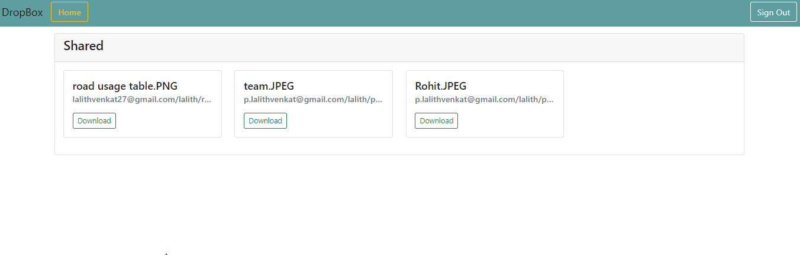
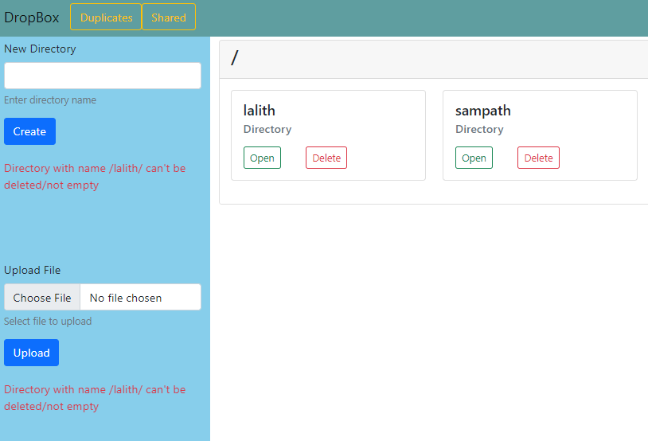

# Dropbox Application

I have created a simplified replica of Dropbox Application using Flask and Google App Engine.

The motivation of this project is to build an application that replicates the functionality of Dropbox cloud service.

In this Application, the users can create arbitary directory structures and can upload files and download files from the service. It also provides some access to basic file sharing between accounts.

I have focussed more on the functionality of this application then the UI part, have a peek of my application.

## SET-UP
Download/clone the project and run the project by running the main.py program.

Before running install all the required packages by running pip install requirements.txt.

use command python main.py to run this Application.

### CODE FILES AND THEIR PURPOSE:
* Main.py -> A python file where the functionality for the web application is defined. 
* duplicates.html-> It provides an interface for checking the duplicate files in the Dropbox.
* shared.html-> A page where the shared files will be accessing for other users.
* Refresh.html-> This page is only to show error and redirects to the home whenever the token gets expired.

#### Sharing of files between accounts

#### Create and Deleting a Directory
Users cannot delete a directory when there is another directory or files inside that directory.

## Documentation of explaining the methods used in this application.

Methods and Functions:

#### 1)	myDict(dict)
Here I have defined a class to access a dictionary's keys using the dot syntax.

#### 2)	parent_path(path) 
Here we are registering our function as a Jinja filter by using the template filter decorator. Which allows you to change the representation of variables in Jinja templates. This function runs rstrip and rpartition methods specifying “/” as separator on the current path and returns the user’s current path.

#### 3)	getShared()
In this function we have defined entity object called SHARED for the datastore, These Entity objects are used to store a collection of attributes together that belong to one entity. This shared entity consists of shared files. This function first checks if the entity key presents in the datastore, if not it then adds to it and then returns all the shared files in the entity.

#### 4) addShared(claims, path, file_name)
This function is responsible for adding the files to the shared folder, This function takes in three attributes such as claims, path and filename. It first calls the getshared function to get the files and checks to see it is present, if not it then creates a blob object with user’s email address, path and name of the file to the object. If the file is not present it then adds the file to the shared list and updates the entity.

#### 5) removeShared(claims, path, file_name)
This function is similar to the above one but, here it removes the shared file unlike adding it to the shared entity. The unshare functionality is provided to the file, if incase the user needs to remove it from sharing.
 
#### 6) retrieveBlob()
This function is responsible for retrieving the blobs from the google app storage. This function will first create a Google Cloud Storage client that will be configured to operate on the project specified by the constants. Next, storage client will return a list of all the blobs in the storage bucket associated with this project. It takes in parameters such as user email, path, file and folder only is set to false to retrieve all the blobs.

#### 7) addBlob()
This function will be responsible for adding the files to the bucket. First it will access to the storage client, and then ask the storage client to perform an action on the bucket we've set up for this project. We've set the blob's filename (which comes from the incoming file parameter to this function) and called for the blob to be uploaded from the contents of that file. Retrievedirectory function is called and set to variable enitity parent and files are checked if they are already present in storage by its filename, if not it will add the file to the list and update the entity parent and returns the blob.

#### 8) Deleteblob()
This function is similar to the above one, but here it is responsible for deleting the files.  Delete method is called on the blob object to delete the files. Removedshared function which was defined earlier is called to the remove the file. Entity parent is updated is by removing the filename by checking in the list and the blob objects are returned.

#### 9) downloadBlob()
This function is responsible for downloading the file into the user’s system. Download as bytes () is used to download the blob object as bytes from the bucket in the storage.

#### 10) downloadShared()
This function is similar to the above one but it is intended for downloading shared files only. Here the blob object doesn’t include the user’s claims data which email.

#### 11) CreateDirectory()
This function is responsible for creating the directories. A child entity for user is created for the directory. Here an empty list for directory and files are defined and retrievedirectory function is called to check if the directory is already exists, if not the directory is added to the list and the entity is updated by adding the entity key to its list.

#### 12) retrieveDirectory()
This function is responsible for retrieving all the user’s directories. 

#### 13) DeleteDirectory()
This function is responsible for deleting the directory. First it check the path of the user’s current directory, if the path of the current directory is root(/) then it just returns the path. It then calls the retrievedirectory function to retrieve all the directories for the user, if that entity has either directory or files in it then it will not delete the directory else it will then delete that directory and update the directory list in the datastore.

#### 14) createHome() 
This function is used to set the home path to the user. The root directory is the child of the parent user entity. All the directories and files that are defined will be returned.

#### 15) createUser()
This function is responsible for creating the user. It calls the createhome function which was defined earlier to update the entity.

#### 16) Retrieveuser()
This function is responsible for retrieving the user claims. 

#### 17) Root()
This function is responsible for redirecting the user to home directory.

#### 18)	Home()
This function first authenticates the user by importing firebase authentication module. This firebase authentication provides the functionality for login and signout. When the user try to login, The function checks for the token that is obtained from cookies through request and tries to validate it.

If the token is obtained, Then if statement will run and execute the try block. The token is validated using the firebase authentication, If it is valid it then calls the createuser() function which was defined earlier. If not it will render the refersh.html page which shows the error message.

POST method is used in this function, From the input given by the user in the form, We check for the following conditions. Such as if the value for new directory is in the request form, Createdirectory() function is called and if the directory is not present, then a new directory will be created and its outputs an error message showing the directory already exists.

If the value for deleting the directing is received which is a selected directory, then the Deletedirectory() function is called to delete that directory, it first checks the conditions for deleting a directory before removing from the list. it outputs an error message accordingly.

If the value is for deleting the selected file then deletebob() function is called to delete the blob object which is a file from the storage bucket. If it is for file sharing for the selected file then the addshare() function is called to add the blob object which is a file to the bucket. Similarly It is for file unshare then removeshared() function is called to execute it.

If the values is for uploading a file, then the addblob() function which was defined previously is called to that add the file to the storage bucket. If the value is for the downloading a selected file in the request form then downloadblob() function which was defined earlier is called for downloading that file.

Here an empty list for hashvalues are defined, retrieveblob() which was defined earlier is called to retrieve all the blobs for that directory as I have set the set the folder only to true. The harshvalues for all the files is generated using md5.hash and if there is a hash value for a file it is then added to list.  An empty duplicate list is defined and all the files with hash files is added to hashval list defined earlier and only the files that has same hash value more than once is retrieved as the duplicate files in the dropbox.

Finally this function then calls the render template() function to render to index.html page along with some additional parameters such as claims, path,direcoty,shared and duplicates.

#### 19) duplicates()
This function is responsible for displaying the duplicate files in the dropbox. Md5.hash is used to generate  hash for each file and the files that has same hash value more than 1 are returned as duplicates. Finally this function calls the render template() function along with user claims and duplictes.

#### 20) shared()
This function is responsible for sharing the files between different users. Firstly upon validating the user claims it then calls the getshared() function which was defined previously for adding files to a shared list. POST request method is used to call the downloadshared () function that was defined only for shared page for downloading the shared content. It then calls the render template function rendering the shared.html page along with additional parameters such as user claims and shared.

## Database model

The database here is the datastore, This is a NoSQL database that works on the data by the key-value pair.
datastore_client = datastore.Client() This will build a datastore client that will enable us to send requests to the datastore to perform CRUD operations

#### Entity type User
This entity stores the user information with user as a key for this entity. This entity will use email address of the user entity for identity the user in the application.

#### Entity type home
This entity is the child of the parent entity user, This entity is set to define the home path of the user.

#### Entity type directory
This is also a child of the parent directory user, This entity is like a parent directory to all the child directories. It stores all the directories.

#### Entity type shared
This is a separate entity defined. It is for sharing the files between the different users.

#### Blob
Binary large object that stores binary data, Here the blob objects are used to store the files into the storage bucket.

